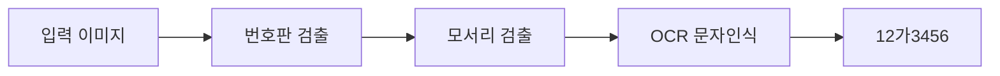

# 🚗 한국어 번호판 인식기

한국어 자동차 번호판 검출 및 인식 시스템 (ONNX Runtime 기반)

## ✨ 주요 기능

- 🔍 **번호판 검출** - 차량 이미지에서 번호판 영역 검출
- 📐 **원근 보정** - 번호판 모서리 검출 및 이미지 변형 보정
- 🔤 **문자 인식** - 한글 및 숫자 문자 인식 (OCR)
- 🖥️ **GUI 애플리케이션** - 사용하기 쉬운 데스크톱 인터페이스
- 📦 **독립 실행 파일** - 최종 사용자를 위해 Python 설치 불필요

## 🛠️ 동작 원리



1. **번호판 검출** - YOLO 모델이 차량 이미지에서 번호판 영역을 검출
2. **모서리 검출** - 번호판의 4개 모서리 좌표 검출
3. **원근 변환** - 기울어지거나 각도가 있는 번호판 이미지 보정
4. **문자 인식** - 한국 번호판에 최적화된 커스텀 YOLO 모델로 문자 인식
5. **문자 정렬** - 기하학적 분석을 통한 문자 순서 정렬

## 📥 설치

### 요구사항

- Python 3.11+
- OS: Linux, macOS, Windows

### 빠른 시작

```bash
# 저장소 클론
git clone https://github.com/sauce-git/korean-license-plate-detector.git
cd korean-license-plate-detector/app

# 가상환경 생성 및 의존성 설치
make install

# 애플리케이션 실행
make run
```

## 🚀 사용법

### GUI 애플리케이션

```bash
make run
```

- 디렉토리 또는 단일 이미지 파일 선택
- "변환" 버튼 클릭하여 처리
- 결과는 `result.xlsx`에 저장

### 디버그 모드 실행

```bash
./dist/korean-license-plate-detector/korean-license-plate-detector --debug
```

### Python 모듈로 사용

```python
import cv2
from detect import get_num

img = cv2.imread("plate.jpg")
plate_number = get_num(img)
print(plate_number)  # 예: "서울31가1234"
```

## 🔨 빌드

### 현재 OS용 빌드

```bash
make build
```

실행 파일은 `dist/korean-license-plate-detector/`에 생성됩니다.

### 크로스 플랫폼 릴리즈

태그를 푸시하면 GitHub Actions를 통해 자동으로 릴리즈가 빌드됩니다:

```bash
git tag v1.0.0
git push --tags
```

다음 플랫폼용 릴리즈가 생성됩니다:
- 🐧 Linux (tar.gz)
- 🍎 macOS (tar.gz)
- 🪟 Windows (zip)

## 📁 프로젝트 구조

```
app/
├── src/                    # 소스 코드
│   ├── widget.py          # GUI 애플리케이션
│   ├── detect.py          # 검출 파이프라인
│   └── utils/             # 유틸리티 모듈
│       ├── model_loader.py # ONNX 모델 로더
│       ├── plate_detector.py
│       ├── plate_warper.py
│       └── number_detector.py
├── train/                  # 학습 노트북
├── Makefile               # 빌드 자동화
└── requirements.txt       # 의존성
```

## 🧠 모델

모델은 Hugging Face에서 자동으로 다운로드됩니다:
- **저장소**: [sauce-hug/korean-license-plate-detector](https://huggingface.co/sauce-hug/korean-license-plate-detector)
- **포맷**: ONNX (추론 최적화)
- **모델 목록**:
  - `plate_detect_v1` - 번호판 검출
  - `vertex_detect_v1` - 모서리 검출
  - `syllable_detect_v1` - 문자 인식

### 수동 모델 다운로드

```bash
# 커스텀 Hugging Face 저장소 설정
export HF_MODEL_REPO=your-username/your-model-repo
make build
```

## ⚙️ 설정

| 환경 변수 | 설명 | 기본값 |
|----------|------|--------|
| `HF_MODEL_REPO` | Hugging Face 모델 저장소 | `sauce-hug/korean-license-plate-detector` |
| `HF_MODEL_CACHE` | 로컬 캐시 디렉토리 | `.cache` |

`.env` 파일을 app 디렉토리에 생성:

```env
HF_MODEL_REPO=sauce-hug/korean-license-plate-detector
```

## 🧪 학습

학습 노트북은 `train/` 디렉토리에 있습니다:

- `train_plate_detector.ipynb` - 번호판 검출 모델 학습
- `train_vertex_detector.ipynb` - 모서리 검출 모델 학습
- `train_text_detector.ipynb` - 문자 인식 모델 학습

## 📄 라이센스

이 프로젝트는 Apache License 2.0으로 배포됩니다. 자세한 내용은 [LICENSE](LICENSE) 파일을 참조하세요.

## 🙏 감사의 글

- YOLO 아키텍처 (객체 검출)
- ONNX Runtime (효율적인 추론)
- PySide6 (GUI 프레임워크)
